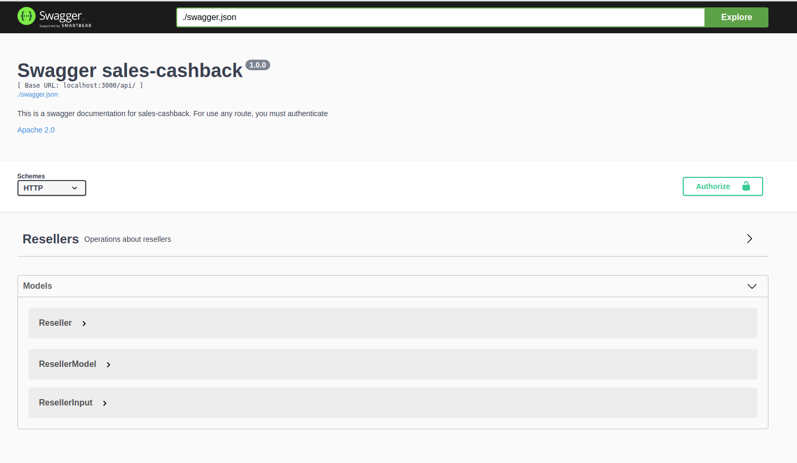

# Simple Object Handler

[](https://circleci.com/gh/cdjohnnatha/sales-cashback)
[](https://circleci.com/gh/cdjohnnatha/sales-cashback/LICENSE)

## Table of Contents

<!-- vscode-markdown-toc -->
1. [Intro](#Intro)
2. [Challenge](#Intro)
3. [Installation](#Installation)
    1. [Node](#Node)
    2. [Makefile](#Makefile)
    3. [Docker](#Docker)
4. [Usage](#Usage)
5. [Database](#Database)
6. [Swagger](#Swagger)
7. [Tests](#Tests)
8. [License](#License)


## 1. <a name='Intro'></a>Intro

The sales-cashback is an api used to help resellers from a company. In this system, it is possible to create new resellers, register orders from them where it has an state of WAITING_APPROVAL and APPROVED and it was created to motivate all resellers with a cashback in their sales. So it will be applied based in few rules a percentagem of a cashback from an order.

This project is also integrated with Circle/ci so it will be applied few rules before a new commit such as run all the tests.

### 1.2. Database architecture


## 2. <a name='Challenge'></a>Challenge

The challenge proposed is to build an api of cashback where the amount is available 
as credit which can be used in next buyings from a reseller. So The rules for that cashback
is is related to when a reseller buy something it gets a cashback from a certain amount.

The system must has:

*   Route to create a new reseller containing at least email, password, cpf and fullname.

*   Route to save orders requiring product code, amount, date and reseller cpf.

*   All orders must be saved as "waiting approval" whithin on exception, if the cpf is 153.509.460-56 and in that case it will be saved as approved.

* List all orders saved returning a code, amount, date, % of cashback for that order and status.

* Get a moment total of cashback which it must be consumed from an external endpoint.

### Rules to be applied at cashback.

* Orders with a max total amount of 1k, the reseller it will get 10% of cashback.

* Orders between 1k and 1.5k, must be applied 15% of cashback.

* More than 1.5k it must be applied 20% of cashback

All this cases are related to a total amount from a period of time.


## 3. 📦 <a name='Installation'></a>Installation


### 3.1 Node
```
  npm install
  npm start
```

### 3.2 Makefile
```
    make production
```
### 3.3 Docker

#### Dependencies

    You need to have a docker and docker-compose installed in your machine.

```
    docker-compose up
```

## 5. 📖 <a name='Database'></a>Database

The database used is PostgreSQL and it was used an ORM called sequelize.js to integrate Node.js with PostgreSQL.


The database initialization it will pretty much create the database, run the migrations and run all seeds:

### 5.1 Node

```
  npm run build-database
```


## 6. 📄 <a name='Swagger'></a>Swagger

All the endpoints has a documentation by swagger which can also be used as an test interface.

**OBS: Swagger ui is only available using docker for this application.**

* You must run the application together with swagger.

To Use Swagger-ui you has to follow the stepps bellow:

### 6.1 Build swagger

It has the commands at a Makefile which runs a container with the Swagger-Ui image at **localhost:8085**.

```
  make swaggerui
```

### 6.2 Generate swagger.json

The **swagger.json** is used as a documentation file which it is splited at docs folder. To create this file just run:

```
  npm run swagger-json
```

### 6.3 Demo

If everything goes fine you can access **localhost:8085**




## 7. 📄 <a name='Tests'></a>Tests

You can run the applications tests with

```
  npm test
```

## 8. 📄 <a name='License'></a>License
Simple Object Handler is [MIT licensed](./LICENSE).